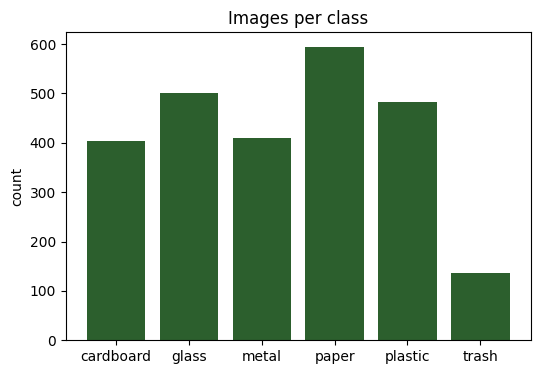
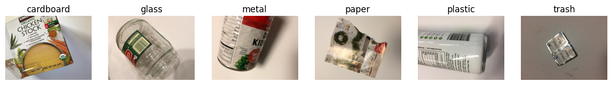
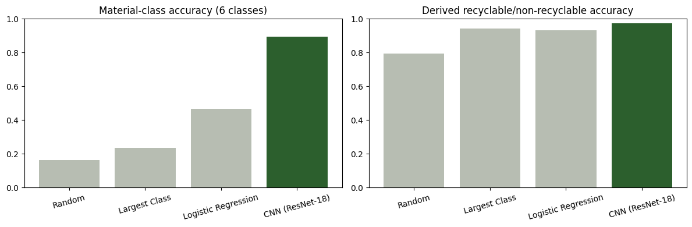
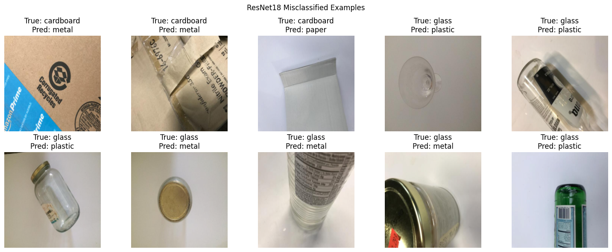

# EcoSort: Teaching AI to Recognize Recyclable Materials Through Images

GitHub repository:
https://github.com/P-Baldinger/EcoSort---Artificial-Neural-Networks

## Introduction and Problem Statement

Every day, millions of tons of waste are produced around the world. One major challenge in improving recycling systems is correctly identifying what materials objects are made from. Humans can easily recognize the difference between materials such as plastic, glass, and cardboard, but computers need to learn these patterns from examples.

The goal of this project was to create **EcoSort**, an artificial intelligence system that can analyze images of waste and predict the material category. Instead of only answering whether an object is recyclable or not, EcoSort identifies the specific material:

- Cardboard
- Glass
- Metal
- Paper
- Plastic
- Trash

The distribution of images across each category is shown below.

https://colab.research.google.com/drive/1LnbmKEdBGv60NltmRHv-WNA6FM7AgwzC#scrollTo=Cg3yZl-4S7ip&line=1&uniqifier=1

This provides more useful information because recycling systems can use the material type to determine how an object should be processed.

The main research question of this project was:

**Can a neural network model accurately identify different types of waste from images, and can it outperform simpler classification methods?**

---

# Methodology & Data

EcoSort uses computer vision, a field of artificial intelligence where models learn patterns from images. Humans recognize objects by noticing features such as shape, texture, and color. A neural network works similarly by learning these patterns from many examples.

The dataset used for this project was the **TrashNet dataset**, which contains over 2,500 labeled images of waste materials.

Dataset source:

https://github.com/garythung/trashnet

The dataset contains six categories:

- Cardboard
- Glass
- Metal
- Paper
- Plastic
- Trash

The images were divided into three groups:

- **Training data (70%)**: Used to teach the model how to recognize materials.
- **Validation data (15%)**: Used to monitor model improvement during training.
- **Testing data (15%)**: Used to measure final performance on images the model had never seen before.

Before training, images were:

1. Resized to the same dimensions.
2. Normalized so they could be processed consistently.
3. Augmented with small changes such as rotation and flipping to improve robustness.

The main neural network used was **ResNet-18**, a convolutional neural network designed for image recognition. Instead of training a completely new model, I used transfer learning. This allows the model to start with knowledge learned from millions of previous images and adapt it to recognizing recycling materials.

To evaluate whether the neural network was actually learning useful information, EcoSort was compared against several simpler approaches:

- Random guessing
- Predicting the most common class
- Logistic Regression
- CLIP zero-shot classification

---

# Results

The final EcoSort model achieved:

## 88.6% Test Accuracy

This means the model correctly identified the material type in nearly 9 out of 10 unseen test images.

The model results compared to other approaches were:

| Model | Accuracy |
|---|---:|
| Random Guessing | 16.4% |
| Most Common Class | 23.4% |
| Logistic Regression | 46.6% |
| CLIP Zero-Shot | 67.4% |
| ResNet-18 EcoSort | 88.6% |

https://colab.research.google.com/drive/1LnbmKEdBGv60NltmRHv-WNA6FM7AgwzC#scrollTo=e4QER1FOS7iq&line=7&uniqifier=1

The model performed especially well on:

| Material | Accuracy |
|---|---:|
| Metal | 95.2% |
| Cardboard | 95.1% |
| Paper | 94.4% |
| Plastic | 93.2% |

The hardest categories were:

| Material | Accuracy |
|---|---:|
| Glass | 76.3% |
| Trash | 72.7% |

The confusion matrix below shows how often the model correctly classified each material and where mistakes occurred.

https://colab.research.google.com/drive/1LnbmKEdBGv60NltmRHv-WNA6FM7AgwzC#scrollTo=j7rhq0UpS7it&line=6&uniqifier=1

---

# Discussion

The results show that a specialized computer vision model can recognize waste materials much better than simpler approaches. Random guessing and basic machine learning methods struggled because they could not effectively understand complex visual patterns.

The ResNet-18 model performed best because it was able to learn important image features such as shapes, textures, and material appearance.

However, some challenges remained. The model had more difficulty identifying glass and trash. Glass objects often have similar appearances to plastic or metal because of reflections and transparency. Trash was difficult because it contains many different objects that do not share a consistent visual pattern.

The most common mistakes were:

- Glass → Plastic
- Glass → Metal
- Trash → Plastic

https://colab.research.google.com/drive/1LnbmKEdBGv60NltmRHv-WNA6FM7AgwzC#scrollTo=kqqLAFwNgbDI&line=24&uniqifier=1

Analyzing these mistakes helped show where future improvements could be made. A larger and more realistic dataset containing dirty, damaged, and overlapping objects would likely improve performance in real-world recycling environments.

Compared to general-purpose AI models such as CLIP, EcoSort performed better because it was specifically trained for the recycling classification task. This demonstrates the importance of adapting AI systems to specific applications.
The CLIP model performed better than traditional approaches but worse than the fine-tuned ResNet-18 model. This suggests that general-purpose vision models already contain useful knowledge about objects, but specialized training improves performance for specific tasks such as recycling classification.

---

# Conclusion

EcoSort demonstrates that artificial intelligence can successfully identify recyclable materials from images.

The ResNet-18 model achieved 88.6% accuracy and significantly outperformed simpler approaches, showing that deep learning models can learn meaningful patterns from waste images.

Although AI alone cannot solve the global recycling problem, systems like EcoSort could help improve automated sorting by making recycling faster, more consistent, and more efficient.

Future improvements could include:

- Training on larger real-world recycling datasets
- Detecting multiple objects in a single image
- Creating a mobile application
- Connecting the model to automated sorting systems
